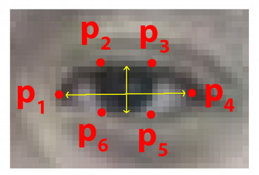

# Drowsiness Detection using OpenCV

The project aims to detect drowsiness in drivers using distance between eyes.


## Applications
This can be used by people who tend to drive for a longer period of time and are prone to drive when drowsy which may lead to accidents

### Code Requirements
The example code is in Python. 

### Dependencies

1) import cv2
2) import imutils
3) import dlib
4) import numpy


### Description

A computer vision system that can automatically detect driver drowsiness in a real-time video stream and then play an alarm if the driver appears to be drowsy.

### Algorithm 

Each eye is represented by 6 (x, y)-coordinates, starting at the left-corner of the eye (as if you were looking at the person), and then working clockwise around the eye.

It checks 20 consecutive frames and if the Eye Aspect Ratio (EAR) is less than 0.25 an alert is triggered.




#### Relationship


#### Summing up


<!-- For more information, [see](https://www.pyimagesearch.com/2017/05/08/drowsiness-detection-opencv/) -->


### Execution 
To run the code, type `python3 Drowsiness_Detection.py`

```
python Drowsiness_Detection.py
```

NOTE: Check the Python version and packages that are compatible. Incompatible versions of packages give rise to errors.


